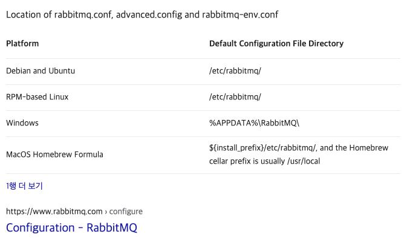
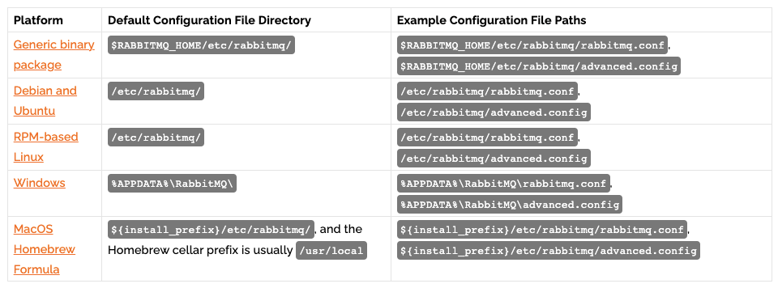

# RabbitMQ 설치, Stomp, Delay 플러그인 설치

RabbitMQ 를 관리형으로 AWS 또는 Azure 에서 지원하는 대로 사용하는 경우도 많을 것이라고 생각된다. 하지만, 인프라가 프라이빗 클라우드 방식일 경우(언론에 알려진 대다수의 IT 대기업 들중 데이터 센터를 가지고 있는 회사들)인 회사들은 그렇게 쉽게 되지 않는다. 직접 사내 클라우드의 리눅스 서버 인스턴스 내에 설치해서 사용해야 한다. 실제 운영 + 모니터링하는 것도 초반에는 개발자가 모두 컨트롤 해야 한다. RabbitMQ를 실제로 관리하는 인프라 부서가 많지 않아서일 듯 하다.<br>

현재는 스타트업에서 일하고 있는데, 현재 회사에서는 AWS를 주력으로 사용하고 있다. 초기 개발시에는 귀찮다는 생각에 AWS 내에 관리형으로 사용하면 될 줄았다. 그런데 왠걸... 15분 지연 시세라는 기능을 만들어야 하는데 delay queue 기능은 현재 관리형에서는 지원되지 않고 있다. (메시지를 00분 지연해서 푸시하는 기능)<br>

Amazon MQ를 사용한다면, 지원되는 플러그인들은 [여기](https://docs.aws.amazon.com/amazon-mq/latest/migration-guide/amazon-mq-supported-plugins.html) 에서 확인할 수 있다. 관리형 MQ에서 Stomp 프로토콜도 지원하는줄 알았는데, RabbitMQ 는 Stomp 플러그인도 직접 설치해서 사용해야 됬었다. RabbitMQ에 지연 메시징, Stomp 프로토콜 지원을 해야 한다면 직접 리눅스에 설치해서 사용하는 것이 나을것 같다. (물론 2021/10/30 현재 시점까지만 상황이 그렇다) <br>

어제부터 Stomp 플러그인을 연동해서 미국 주식 시세 웹소켓 PUSH 기능을 구현을 시작했다. 이 작업이 끝나고 나면, 12월 달에는 RabbitMQ에 클러스터링 작업을 시작할 것 같은데, 이때 또 여기에 설치하면서 겪은 것들을 정리하게 되지 않을까 싶다.<br>

아마도 현재 인스턴스는 개발 존에서 사용하고, 조금 고 사양으로 올라간 인스턴스를 12월에 사용하자고 이야기해서, 개발존과 라이브존을 분리하는 게 맞지 않을까 하는 생각도 드는데, 인프라쪽 담당자 분도 생각하고 있는 게 있을수 있기에 다음주에 이야기를 해봐야 뭐가 나오지 않을까 싶다.<br>

래빗엠큐 관련 내요들 정리만 시작하면 뭔가 횡설수설하기 시작한다. 뭔가 확실한게 없고 죄다 찾아서 해야 하다보니, 요약이 잘 안되는 것 같다.<br>

<br>

## 참고자료

- [Install - Debian and Ubuntu](https://www.rabbitmq.com/install-debian.html)
- [Installing on Debian and Ubuntu](https://www.rabbitmq.com/install-debian.html#manual-installation)
- [RabbitMQ packages have unmet dependencies](https://askubuntu.com/questions/1188699/rabbitmq-packages-have-unmet-dependencies)

<br>

## apt-key 

RabbitMQ 설치시에 Erlang 언어를 설치해야 하는데 이 때 apt-key 관련해서 문제가 있다.<br>

자세한 내용은 [Install - Debian and Ubuntu](https://www.rabbitmq.com/install-debian.html) 를 참고<br>

```bash
$ sudo apt-key adv --keyserver "hkps://keys.openpgp.org" --recv-keys "0x0A9AF2115F4687BD29803A206B73A36E6026DFCA"
$ sudo apt-key adv --keyserver "keyserver.ubuntu.com" --recv-keys "F77F1EDA57EBB1CC"
$ curl -1sLf 'https://packagecloud.io/rabbitmq/rabbitmq-server/gpgkey' | sudo apt-key add -
```

<br>

## 우분투 리포지터리 추가

공식문서에서 언급하기로는 ubuntu 20 부터는 `focal` 이라는 저장소를 사용해야 Erlang 을 설치할수 있다. 아래 명령어는 ubuntu20 에서 focal을 사용해야 한다는 부분의 명령어를 요약한 내용이다.

```bash
$ sudo tee /etc/apt/sources.list.d/rabbitmq.list <<EOF
# 나타나는 콘솔창에서 아래의 명령을 차례로 입력해준다. 
# 자세한 내용은 공식문서를 참고할것 

> deb http://ppa.launchpad.net/rabbitmq/rabbitmq-erlang/ubuntu focal main
> deb-src http://ppa.launchpad.net/rabbitmq/rabbitmq-erlang/ubuntu focal main
> deb https://packagecloud.io/rabbitmq/rabbitmq-server/ubuntu/ focal main
> deb-src https://packagecloud.io/rabbitmq/rabbitmq-server/ubuntu/ focal main
> EOF

가장 마지막은 EOF 라는 문자를 타이핑해서 빠져나오기
```

<br>

## RabbitMQ, apt-transport-https 설치

```bash
$ sudo apt-get update -y
$ sudo apt-get install rabbitmq-server -y --fix-missing
$ sudo apt-get install apt-transport-https
```

<br>

## RabbitMQ 구동

```bash
$ sudo service rabbitmq-server start
$ sudo service rabbitmq-server status
$ sudo service rabbitmq-server stop
```

<br>

## RabbitMQ CLI

https://www.rabbitmq.com/cli.html 

RabbitMQ가 기본으로 제공하는 CLI 들은 아래와 같다.

- [rabbitmqctl](https://www.rabbitmq.com/rabbitmqctl.8.html)

   for service management and general operator tasks

- [rabbitmq-diagnostics](https://www.rabbitmq.com/rabbitmq-diagnostics.8.html)

   for diagnostics and [health checking](https://www.rabbitmq.com/monitoring.html)

- [rabbitmq-plugins](https://www.rabbitmq.com/rabbitmq-plugins.8.html)

   for [plugin management](https://www.rabbitmq.com/plugins.html)

- [rabbitmq-queues](https://www.rabbitmq.com/rabbitmq-queues.8.html)

   for maintenance tasks on [queues](https://www.rabbitmq.com/queues.html), in particular [quorum queues](https://www.rabbitmq.com/quorum-queues.html)

- [rabbitmq-upgrade](https://www.rabbitmq.com/rabbitmq-upgrade.8.html)

   for maintenance tasks related to [upgrades](https://www.rabbitmq.com/upgrade.html)

<br>

## 사용 포트

- 25672 - 0.0.0.0/0
- 4369 - 0.0.0.0/0
- 5671 ~ 5672 - 0.0.0.0/0
- 15672 - 사내망
- SSH - 사내망

<br>

## Stomp 플러그인 설치

> 참고 : [Stomp 플러그인 설치](https://www.rabbitmq.com/stomp.html)<br>

- 설치된 래빗 엠큐 인스턴스에 접속 → Shell 커맨드 실행

```bash
$ sudo rabbitmq-plugins enable rabbitmq_stomp
```

<br>

```plain
...

Enabling plugins on node rabbit@rabbtimq-test-temp:
rabbitmq_stomp
The following plugins have been configured:
  rabbitmq_stomp
Applying plugin configuration to rabbit@rabbtimq-test-temp...
The following plugins have been enabled:
  rabbitmq_stomp

started 1 plugins.
```

<br>

## RabbitMQ 의 설정파일

> Stomp 플러그인으로 접속할 user/pw, port 등을 설정해줘야 한다.

<br>

### 설정 파일 경로

공식문서 상으로는 기본 설정파일이 각 OS 버전별 배포판마다 제공되는 것처럼 명시되어 있으나, 그렇지 않다. 직접 설정을 해야 한다.

- enabled_plugins
- rabbitmq.conf, advanced.conf

<br>

#### enabled_plugins

[http://www.rabbitmq.com/configure.html](https://www.rabbitmq.com/configure.html)



<br>

#### rabbitmq.conf, advanced.conf

> 참고: [www.rabbitmq.com/configure.html#config-location](https://www.rabbitmq.com/configure.html#config-location)

<br>

**기본 설정 파일 저장 위치**<br>

ubuntu 

- `/etc/rabbitmq/rabbitmq.conf` 
- `/etc/rabbitmq/advanced.config` 

<br>



<br>

### RabbitMQ 설정 파일 커스터마이징

기본 설정으로 리포지터리에서 다운받아 설치한 후 사용할 때, 기본 설정 그대로 있을 때 `/etc/rabbitmq/` 내에 어떠한 설정파일도 있지 않다. 따라서 Example Configuration File 을 어느 정도는 참조해야 한다. 대부분의 RabbitMQ 배포판은 예제 파일이 같은 디렉터리에 있다. 하지만, 데비안이나 RPM 배포판 계열의 리눅스에 설치된 RabbitMQ 배포판은 정책적으로 이것이 불가능하기에 `/usr/share/doc/rabbitmq-server` 내에 example 파일이 있다. <br>

파일 명은 `set_rabbitmq_policy.sh.example` 인데, 직접 이 파일은 직접 보기가 불편하다. 따라서 위의 링크에서 안내하는 아래의 URL 에서 예제를 제공하는데 이것을 사용해서 설정해야 한다.<br>

- rabbitmq.conf Example
  - https://github.com/rabbitmq/rabbitmq-server/blob/master/deps/rabbit/docs/rabbitmq.conf.example
- advanced.config Example
  - https://github.com/rabbitmq/rabbitmq-server/blob/master/deps/rabbit/docs/advanced.config.example

<br>

## Stomp 플러그인 설정 (rabbitmq.conf 커스터마이징)

### TCP Listeners

Stomp 플러그인을 enable 해둔 후 별다른 설정을 해두지 않는다면, STOMP Adapter 는 61613 포트에서 대기하고 있는다. 그리고 기본으로 지정되는 사용자/패스워드는 `guest/guest` 다.<br>

Listener 포트를 변경하려면 [Configuration File](https://www.rabbitmq.com/configure.html#configuration-file) 을 수정해야 한다. Configuration 은 우분투에서는 보통 `/etc/rabbitmq`  아래에 `rabbitmq.conf` 라는 이름의 파일을 만들어두어 관리하는 편이다. **rabbitmq.conf 예제** 에 Listener 에 관련 된 설정을 추가하는 예제를 정리해두었다.<br>

ex) <br>

```plain
# =======================================
# STOMP section
# =======================================

## See https://rabbitmq.com/stomp.html for details.

## TCP listeners.
##
stomp.listeners.tcp.1 = 127.0.0.1:61613
stomp.listeners.tcp.2 = ::1:61613

## TCP listener settings
##
stomp.tcp_listen_options.backlog   = 2048
stomp.tcp_listen_options.recbuf    = 131072
stomp.tcp_listen_options.sndbuf    = 131072
#
stomp.tcp_listen_options.keepalive = true
stomp.tcp_listen_options.nodelay   = true
```

<br>

### 접속환경 설정 및 계정 정보 추가

```plain
stomp.default_user = gosgjung
stomp.default_pass = soongood~!@#$
```

<br>

### ex) rabbitmq.conf 추가 내용들

- Tcp Listener 네트워크 주소
- Tcp Listener backlog, recbuf, sendbuf (backlog 버퍼, 수신버퍼(=recbuf), 발신버퍼(=sendbuf))

```plain
# =======================================
# STOMP section
# =======================================

## See https://rabbitmq.com/stomp.html for details.
## TCP listeners.
##
stomp.listeners.tcp.1 = 127.0.0.1:61613
stomp.listeners.tcp.2 = ::1:61613

## TCP listener settings
##
stomp.tcp_listen_options.backlog   = 2048
stomp.tcp_listen_options.recbuf    = 131072
stomp.tcp_listen_options.sndbuf    = 131072
#
stomp.tcp_listen_options.keepalive = true
stomp.tcp_listen_options.nodelay   = true

stomp.default_user = gosgjung
stomp.default_pass = soongood~!@#$

```

<br>

