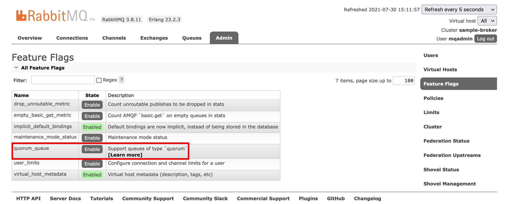

# 0. Spring AMQP 공식문서 SUMMARY

Spring AMQP 공식문서의 내용을 요약 및 시나리오기반 테스트&개념 정리

- [docs.spring.io - Spring AMQP](https://docs.spring.io/spring-amqp/docs/current/reference/html/)
- [rabbitmq.com - RabbitMQ Best Practices](https://www.rabbitmq.com/best-practices.html)

 

### 큐 가용성

> **참고자료**
>
> - [Part 1 - RabbitMQ Best Practice : number of queues](https://www.cloudamqp.com/blog/part1-rabbitmq-best-practice.html#number-of-queues)
> - [Part 1 - RabbitMQ Best Practice - Part 1](https://www.cloudamqp.com/blog/part1-rabbitmq-best-practice.html)
> - [Part 2 - RabbitMQ Best Practice - Part 2](https://www.cloudamqp.com/blog/part2-rabbitmq-best-practice-for-high-performance.html)

 

**큐 하나가 처리할 수 있는 메시지의 갯수** 

큐 하나는 이론 상으로 최대 5만건의 메시지를 처리 가능하다. 따라서 여러개의 Queue를 사용할 경우 가능한 한도 내에서는 멀티코어를 사용하는 것이 권장된다. 커넥션, 큐가 많을 경우에는 CPU, RAM 사용량을 줄이려면, busy polling 을 꺼두어야 한다. 

**최대 메시지 사이즈, 최대 처리 메시지 갯수** 

RabbitMQ 3.7.0 에서 한번에 보낼 수 있는 메시지의 한계치는 이론적으로 2GB 다. 그리고 공식 페이지에서는 한번에 메시지를 가장 최대로 보낼 때 안정적인 메시지의 사이즈로 128MB를 권장하고 있다. 

 

**Kepp Your Queue Short (If possible)** 

큐 안에 대기하는 데이터가 많아지면 디스크 공간을 사용하게 되므로 큐 안에 저장하는 데이터의 양을 많게 하지 말라는 권고사항. 

디스크 공간을 사용하는 것의 단점을 조금이나마 속도가 느려질 수 있다는 점이다. (=하지만 정교한 실시간 처리보다 안정성이 중요하다면 포기해도 되는 옵션이라고 생각된다.) 

 

**Use Quorum Queues** 

Rabbit 3.8 부터는 Quorum Queue 라는 종류의 큐가 새롭게 추가되었는데, 공식 문서에서는 이 Quorum Queue 를 사용할 것을 권고하고 있다. 

위 그림은 AmazonMQ 에서 quorum queue 를 활성화하는 메뉴를 캡처한 모습이다. 

- 관리자 화면 > Admin > Feature Flags > quorum_queue > Enable

 

**앞으로 더 정리해야 할 것들** 

- 소비자 측 - MassageListenerContainer Conf
  - batchSize 설정
  - 얼마까지만 받고 있다가 일정량을 받으면 한번에 DB에 insert 하는 방식을 구현할 때 좋은 지침이 될 것 같아 일단은 자료를 스크랩 해두었는데, 일정관리를 꼭 잘해서 적용해봐야 할 것 같다.!!!

- [Testing Support](https://docs.spring.io/spring-amqp/docs/current/reference/html/#testing)

 

### 메시지 Batch 처리

> 정리 문서
>
> - [메시지 Batching - BatchingRabbitTemplate](https://github.com/gosgjung/study-rabbitmq/blob/develop/docs/%EB%A9%94%EC%8B%9C%EC%A7%80-Batching-%EB%B0%9C%EC%86%A1-BatchingRabbitTemplate.md)
>
> - 메시지 Batch 발송 + 메시지 Batch 리슨 에 대해 정리해두었다.
>
> 참고 자료
>
> - [@RabbitListener with Batching](https://docs.spring.io/spring-amqp/docs/current/reference/html/#receiving-batch)

 

메시지 Batch 처리를 할 경우. 생산자, 소비자에 모두 설정할 수 있다. 예를 들면 메시지를 단건으로 일일이 저장하기보다는 1000건을 한번에 모았다가 저장하는 경우를 예로 들어보자.  

**생산자 측의 Batching 처리** 

이 경우 생산자 측에서 메시지가 1000건이 생길 때까지 모았다가 익스체인지에 전달(rabbitTemlate.convertAndSend() )하면 된다. 이런 처리는 BatchingRabbitTemplate 내부에서 편의성을 제공해주고 있어서 해당 설정을 구현한다면 프로그래머가 직접 메시지가 일정 건수까지 모일때까지 기다리지 않아도 된다. 

자세한 내용은 [여기](https://github.com/gosgjung/study-rabbitmq/blob/develop/docs/%EB%A9%94%EC%8B%9C%EC%A7%80-Batching-%EB%B0%9C%EC%86%A1-BatchingRabbitTemplate.md#%EB%A9%94%EC%8B%9C%EC%A7%80-batching-%EB%B0%9C%EC%86%A1---batchingrabbittemplate) 를 참고하자. 

 

**소비자 측의 Batching 처리** 

생산자 측에서 Batching 처리를 해서 convertAndSend(...) 한번에 여러개의 묶음 데이터를 보내게 되더라도, 소비자 측의 리스너에 별다른 설정 없이 @RabbitListen 할 경우 Batch 메시지를 1건씩 읽어들인다. 

이때 RabbitLsitenerContainerFactory 를 구현한 SimpleRabbitListenerFactory 내의 batchLister 필드를 true 로 설정해서 batch 리슨을 활성화하고, 이 SimpleRabbitListenerFactory를 Bean으로 설정해서 @RabbitListen 의 containerFactory 필드에 주입해주면 된다.  

자세한 내용은 [여기](https://github.com/gosgjung/study-rabbitmq/blob/develop/docs/%EB%A9%94%EC%8B%9C%EC%A7%80-Batching-%EB%B0%9C%EC%86%A1-BatchingRabbitTemplate.md#rabbitlistener-2---%EB%A9%94%EC%8B%9C%EC%A7%80-batch-%EB%A6%AC%EC%8A%A4%EB%8B%9D)를 참고하자. 

 

### RabbitTemplate 커넥션 관리 - ConnectionFactory

자세한 내용은 [RabbitTemplate-커넥션-관리---ConnectionFactory.md](https://github.com/gosgjung/study-rabbitmq/blob/develop/docs/RabbitTemplate-%EC%BB%A4%EB%84%A5%EC%85%98-%EA%B4%80%EB%A6%AC---ConnectionFactory.md) 에 정리해두었다. 

 

### 큐 - TTL 설정

`2021/08/01` : 별도의 테스트 시나리오/캡처와 함께 다른 문서에 따로 정리할 예정이다. 

자세한 내용과 개념, 예제는 [Queue-TTL설정.md](http://asdfsadfasdf) 에 따로 정리해두었다. (별도 문서 Merge 후 링크 반영하기) 

 

### 생산자/익스체인지 - 메시지 지연 전달방식(1)

자세한 내용과 개념, 예제는 [메시지 딜레이 전송.md](https://github.com/gosgjung/study-rabbitmq/blob/develop/docs/%EB%A9%94%EC%8B%9C%EC%A7%80-%EB%94%9C%EB%A0%88%EC%9D%B4-%EC%A0%84%EC%86%A1.md) 에 정리해 두었다. 

 

### Retry with Batch Listeners

> 정리 필요

- [Retry with Batch Listeners](https://docs.spring.io/spring-amqp/docs/current/reference/html/#resilience-recovering-from-errors-and-broker-failures)

이것도 정리해야 한다. 

### MessageListenerContainerConfiguration - batchSize 설정

> 정리 필요

- [Message Listener Container Configuration](https://docs.spring.io/spring-amqp/docs/current/reference/html/#containerAttributes)

 

### 생산자 측 - Connection을 다수의 채널로 다중화

Connection 을 논리적인 개념인 채널로 만드는 과정에 대해 정리해야 한다. 아직 자료를 찾긴 했는데 정리는 언제할지 모르겠다. 아직까지는 필요하지는 않다. 

- [Channel](https://rabbitmq.github.io/rabbitmq-java-client/api/current/com/rabbitmq/client/Channel.html#waitForConfirms(long))
- [rabbitmq.com - Publishers](https://www.rabbitmq.com/publishers.html)

 

### Resilience: Recovering from Errors and Broker Failures

스프링 클라우드 스택의 여러 스택들과 조화를 이룰수 있도록 이번 개발이 끝나면 또 고도화 하면서 준비하게 될 사항이 되지 않을까 싶다. 아래의  Rtry with Batch Listeners 역시 같은 내용이다.

- [Resilience : Recovering from Errors and Broker Failures](https://docs.spring.io/spring-amqp/docs/current/reference/html/#resilience-recovering-from-errors-and-broker-failures)

 

