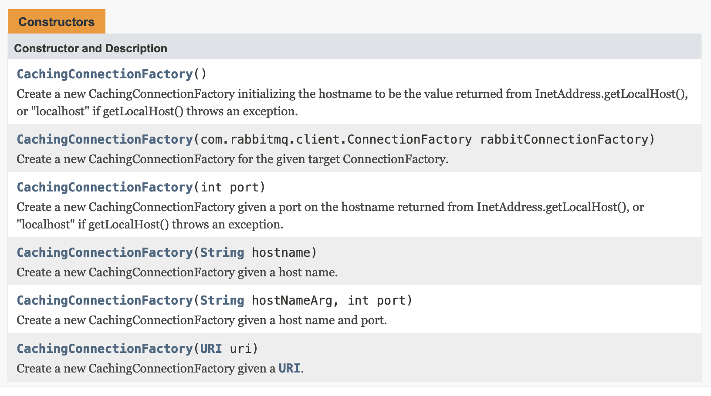

# RabbitTemplate 커넥션 관리 - ConnectionFactory

이번에 정리할 내용은 ConnectionFactory에 대한 내용이다.

- [docs.spring.io - Connection and Resource Management](https://docs.spring.io/spring-amqp/docs/current/reference/html/#connections)

<br>

별도로 분리된 커넥션을 사용하는 `RabbitTemplate` 을 설정할 때, `2.3.2` 버전 부터는 퍼블리싱 작업을 하는 Connection Factory 를 다른 종류로 지정해주면 된다. 기본 설정은 메시지를 퍼블리싱하는 팩토리는 같은 타입이다. 그리고 메인 팩토리에 설정된 프로퍼티 값들은 메시지를 퍼블리싱하는 팩토리로 전이(propagated)된다.<br>

Spring RabbtMQ 에서 지원되는 ConnectionFactory 관련 클래스들은 아래의 3가지이다.

- `PooledChannelConnectionFactory`
- `ThreadChannelConnectionFactory`
- `CachingConnectionFactory`

<br>

## `PooledChannelConnectionFactory`

- Spring AMQP 2.3 에서부터 추가된 클래스이다.
- 대부분의 경우에는 `PooledChannelConnectionFactory` 가 사용된다.
- Apache Pool2 라이브러리(`commons-pool2`)를 기반으로 커넥션 1개, 풀 2개를 관리한다. Apache Pool2 라이브러리(`commons-pool2` )는 Spring AMQP 내에 포함된 라이브러리이다.
  - 트랜잭션 처리가 필요한 채널(Transactional Channel)을 관리하는 풀
  - 트랜잭션이 아닌 채널(Non Transactional Channel)을 관리하는 풀
- 추가되는 풀 2개는 기본적인 설정을 해둔 GenericObjectPool 타입의 인스턴스로 생성된다. 더 자세한 내용은 공식문서에서도 Apache 공식문서를 참조하라고 하는군.


### 예제

```java
@Bean
PooledChannelConnectionFactory pcf() throws Exception {
    ConnectionFactory rabbitConnectionFactory = new ConnectionFactory();
    rabbitConnectionFactory.setHost("localhost");
    PooledChannelConnectionFactory pcf = new PooledChannelConnectionFactory(rabbitConnectionFactory);
    pcf.setPoolConfigurer((pool, tx) -> {
        if (tx) {
            // configure the transactional pool
        }
        else {
            // configure the non-transactional pool
        }
    });
    return pcf;
}
```

<br>

## `ThreadChannelConnectionFactory`

- 엄격한 메시지 순서를 보장하고자 할때 사용된다.
- 커넥션 1개, `ThreadLocal` 2개 를 사용한다.
  - 참고) [자바캔 - ThreadLocal](https://javacan.tistory.com/entry/ThreadLocalUsage) , [ThreadLocal 이란?](https://yeonbot.github.io/java/ThreadLocal/) 
- 이 2개의 각각의 ThreadLocal 은 아래와 같은 성격을 가진다.
  - 트랜잭션 처리가 필요한 채널들에 사용되는 ThreadLocal
  - 트랜잭션 처리가 필요하지 않은 채널들에 사용되는 ThreadLocal
- [Scoped Operation](https://docs.spring.io/spring-amqp/docs/current/reference/html/#scoped-operations) 없이도 메시지의 순서를 보장할 수 있도록 해준다.

<br>

## `CachingConnectionFactory`

> 참고)
>
> CachingConnectionFactory 를 사용할 때 커넥션 하나를 여러개의 채널로 공유하는데, 이와 비슷한 개념으로 JMS에서는 Connection 하나를 여러개의 session 으로 공유한다.

<br>

CachingConnectionFactory 는 Connection 과 Channel 을 생성하는 메서드들을 제공한다. CachingConnectionFactory 인스턴스를 생성해 Bean으로 등록해 사용하게 될때, CachingConnectionFactory 에 여러가지 설정을 해둘 수 있다. <br>

이때 CacheMode를 CONNECTION 으로 설정할 경우, 기본으로 선언되어 있는 Exchange, Queue, Binding 에 대한 설정들이 모두 무시되게 된다. CachingConnectionFactory의 기본 CacheMode 는 `CacheMode.CHANNEL`이다. ([참고](https://docs.spring.io/spring-amqp/docs/current/api/org/springframework/amqp/rabbit/connection/CachingConnectionFactory.html))<br>

참고)<br>

- [Automatic Declaration of Exchanges, Queues, Bindings](https://docs.spring.io/spring-amqp/docs/current/reference/html/#automatic-declaration) 
- [CachingConnectionFactory.CacheMode](https://docs.spring.io/spring-amqp/docs/current/api/org/springframework/amqp/rabbit/connection/CachingConnectionFactory.html#setCacheMode-org.springframework.amqp.rabbit.connection.CachingConnectionFactory.CacheMode-)

<br>

### Spring AMQP 에서의 Connection과 Channel

- 기본 설정으로 커넥션 프록시 1개를 생성한다. 이 1개의 커넥션 프록시는 애플리케이션이 공유하게 된다.
- AMQP 메시징을 위한 "작업의 단위"가 실제로 "채널"이기 때문에 커넥션을 공유하는 것이 가능하다. ("채널"은 논리적으로 구분된 커넥션 내에 정의하는 가상의 연결이다. 즉, 프로그램 적으로 구분한 하나의 단위이다.)
- Connection 인스턴스에는 createChannel 메서드가 있다.  

<br>

구현체 CachingConnectionFactory 를 사용하면 Connection 이 생성한 Channel 인스턴스들을 캐싱할 수 있다. 그리고 CachingConnctionFactory 는 트랜잭션인지 여부에 따라 각 channel 들의 캐시들을 유지하고 관리(maintain)한다.<br>


### CachingConnectionFactory 의 생성자

Bean 을 직접 설정하기 위해 CachingConnectionFactory를 직접 생성할 때는 CachingConnectionFactory 는 Builder 패턴으로 제공되는 API가 없기에 직접 생성자로 인스턴스를 생성해야 한다.<br>

CachingConnectionFactory 클래스의 새성자는 아래와 같이 hostname, port 등을 입력하는 버전의 여러가지 생성자들이 오버로딩되어 있다.

참고 : [docs.spring.io/spring-amqp](https://docs.spring.io/spring-amqp/docs/current/api/org/springframework/amqp/rabbit/connection/CachingConnectionFactory.html)<br>

**CachingConnectionFactory 의 생성자들**<br>



<br>

### 채널 캐시 사이즈 지정

채널의 캐시 사이즈는 CachingConnectionFactory 클래스 내의 `setChannelSize()` 메서드로 세팅가능하다. (아무런 설정도 하지 않는다면, 기본값은 25로 세팅되어 인스턴스가 생성된다.)<br>


### createChannel()

`Spring AMQP 1.3` 에서부터 Connection 과 Chnnel 을 캐시하기 위한 용도로 CachingConnectionFactory를 직접 설정할 수 있게 되었다. <br>

Connection 을 생성하는 것은  `createChannel()` 메서드로 생성한다. 그리고 Connection 을 닫을 때는 커넥션의 갯수가 `캐시사이즈`에 도달하지 않은 경우에 한해, 이것을 Cache 에 반납(return)한다. Connection 객체들을 캐싱하기 위해서는 `cacheMode`필드를 `CacheMode.CONNECTION` 로 세팅한다.<br>

> 참고) cache size 를 지정할 때는 CachingConnectionFactory 클래스의 setChannelCacheSize() 메서드를 사용한다. 아무 설정도 안했을 때의 채널의 캐시 사아즈는 25이다.

이렇게 CachingConnectionFactory 클래스는 createChannel()과 캐시사이즈로 Connection 들을 캐싱하고 관리할 수 있는데, Connection 내에 생성된 Channel 들도 캐싱하고 관리하는 것 역시 가능하다.<br>


### 분산환경에서의 채널관리

CachingConnectionFactory 를 사용하면 커넥션들을 분리해서 사용할 수 있다. HA cluster, 로드밸런서 같은 분산환경을 사용할 경우에 이렇게 각각의 분리된 커넥션을 사용해서 개별클러스터 멤버들과 connection 을 맺을 수 있기에 커넥션들을 개별로 분리해서 관리하는 것은 분산환경에서도 유용하다.<br>


### connectionLimit (1.5.5+)

1.5.5 버전부터는 커넥션의 수를 세팅할 수 잇는 connectionLimit 필드가 도입되었다. connectionLimit 필드는 connection 객체들의 총 갯수를 제한할 수 있도록 해준다. <br>

이렇게 connectionLimit 필드는 생성할 수 있는 connection 갯수들의 최댓값을 정의하는 것이 목적이다. 그리고 channelCheckoutTimeLimit 필드로 channel 의 타임아웃을 지정하는 것이 가능하다. 만약 connection 의 갯수가 connectionLimit 에 도달했고, 커넥션중 하나가 channelCheckoutTimeLimit 에 도달한 경우에 CachingConnectionFactory 는 `AmqpTimeoutException` 을 throw 한다.<br>


### channelCheckoutTimeout

Starting with version 1.4.2, the `CachingConnectionFactory` has a property called `channelCheckoutTimeout`. When this property is greater than zero, the `channelCacheSize` becomes a limit on the number of channels that can be created on a connection. If the limit is reached, calling threads block until a channel is available or this timeout is reached, in which case a `AmqpTimeoutException` is thrown.<br>


### 커넥션 풀의 스레드 풀 사이즈

스레드 풀의 크기가 `Runtime.getRuntime.availableProcessors() * 2` 만큼 생성된다. 커넥션의 갯수가 많을 때는 커스텀  executor 를 CachingCononectionFactory 내에 세팅해주는 것을 고려해 봐야 한다. 이렇게 하면  executor 로 모든 커넥션들을 사용할 수 잇고, 이 executor 스레드는 공유된다. executor 스레드는 한계가 정해지지 않아야(unbound) 하고 적절하게 세팅되어야 한다.<br>

하나의 커넥션에 채널 여러개가 있을 때는, 스레드 풀의 사이즈가 동시성(concurrency)에 영향을 준다. 따라서 thread pool executor 는 적절하게 세팅되어야한다.


### `CacheMode.CONNECTION`

조금 더 깔끔하게 다시 정리 필요

- 커넥션이 캐싱되도록 하려면 cacheMode 필드를 `CacheMode.CONNECTION` 으로 세팅해주면 된다.
- cacheMode 필드를 CacheMode.CONNECTION 으로 설정하면, RabbitMQ 의 queue 및 기타 리소스에 대한 기본 선언들이 무효화 되어 직접 설정을 해야 한다.
- CacheMode.CONNECTION 을 설정해서 커넥션을 캐싱하게 되면, `amqp-client` 라이브러리가 각 커넥션에 대해 고정된 스레드 풀(fixed thread pool)을 생성한다. 디폴트로 내부에 지정된 thread pool 내에 포함될 수 있는 스레드의 갯수는 `Runtime.getRuntime().availableProcessors() * 2` 이다.
- 커넥션의 갯수가 많을 때는 커스텀  executor 를 CachingCononectionFactory 내에 세팅해주는 것을 고려해 봐야 한다. 이렇게 하면  executor 로 모든 커넥션들을 사용할 수 잇고, 이 executor 스레드는 공유된다. executor 스레드는 한계가 정해지지 않아야(unbound) 하고 적절하게 세팅되어야 한다.


### Cache Size 의 의미

Cache size 는 limit 이 아니다. 단순히 캐싱될 수 있는 채널의 갯수이다. Cache Size 가 10 개이면 몇 개의 채널이든 실제로 사용될 수 있다. 만약 10 채널 이상이 사용되면 넘어선 만큼은 캐싱된다.<br>

Spring AMQP 1.6 부터는 채널의 기본 캐시 사이즈가 1에서 25로 늘어났다. High Voumn, Multi-Thread 환경에서 적은 캐시를 사용한다는 것은 채널이 생성되고 닫히는(created and closed) 동작이 높은 빈도로 발생할 수 있다는 의미이다. 기본 캐시 사이즈를 늘리면 오버해드를 줄일수 있다.<br>

RabbitMQ Admin UI 에서 채널들을 모니터할 수 있고, 많은 채널들이 생성되었다가 종료된다면(created and closed), 캐시 사이즈를 늘리는 것을 고려해볼 수 있다. 캐시는 오직 필요에 의해 늘어나기 때문에 volume이 낮은 애플리케이션들에 영향을 주지는 않는다.<br>

**channelCheckoutTimeout**<br>

1.4.2 버전부터는 cachingConnectionFactory 는 `channelCheckoutTimeout` 이라는 프로퍼티가 생겼다. channelCheckoutTimeout 이 0 보다 큰 정수가 되었다는 것은 timeout이 발생했다는 의미인데, 이 경우 커넥션이 만들수 있는 채널들의 수에 limit(제한)이 생긴다.<br>

그리고 이 limit(제한)에 도달하면, timeout 에 도달할 때까지 또는 채널을 사용할 수 있을 때까지 스레드 차단이 호출된다. 그리고 `AmqpTimeoutException` 이 발생한다.<br>

프레임워크 내에서 사용되는 Channel 들은 신뢰성있게 캐시로 반환된다. 예를 들면 RabbitTemplate으로 추상화한 Spring-AMQP를 예로 들 수 있다. 만약 사용자가 직접 채널들을 프레임워크 바깥에서 생성하면(createChannel() 함수 사용), 이것을 반환(회수)하는 것 역시 신뢰성 있게 구현해주어야 한다. 예를 들면 finally 블록과 같은 곳에서 반환(회수)하는 구문을 작성해주어야 한다.<br>


## `SingleConnectionFactory`

SingleConnectionFactory 를 implementation 해서 사용하는 것 역시 가능한데, 이것은 unit test 에서만 사용가능하다. CachingConnectionFactory 에 비해 비교적 많이 간단하다. SingleConnectionFactory 는 channel들을 캐시하지 않는다. <br>

하지만 SingleConnectionFactory 는 실제 사용을 목적으로 생긴 것은 아니다. 성능과 회복력이 좋지 않기 때문에 실제 사용하는 코드에서는 사용하지 않을 것을 권장한다. 만약 ConnectionFactory 를 커스터마이징해야만 하는 상황이라면 AbstractConnectionFactory 라는 클래스를 상속받아서 사용하는 것이 좋은 방식이다.<br>


## ConnectionFactory 생성 (1)

가장 단순한 방식이다. 아무 설정도 하지 않는다면 Spring AMQP 내의 디폴트 설정에 따라 `CachingConnectionFactory` 타입의 인스턴스가 생성된다. 채널의 기본 캐시 사이즈는 25 이다.  

```xml
<rabbit:connection-factory id="connectionFactory"/>
```

<br>

## ConnectionFactory 생성 (2)

만약 더 많은 수의 채널들이 캐시되게끔 하고 싶다면 `channelCacheSize` 프로퍼티를 더 큰 값으로 설정해주면 된다.<br>

예를 들면 xml 설정으로 캐시 사이즈를 50으로 세팅하는 설정은 아래와 같은 모습이다.

```xml
<bean id="connectionFactory"
      class="org.springframework.amqp.rabbit.connection.CachingConnectionFactory">
    <constructor-arg value="somehost"/>
    <property name="username" value="guest"/>
    <property name="password" value="guest"/>
    <property name="channelCacheSize" value="50"/>
</bean>
```

xml 설정을 Java 설정으로 바꿔서 표현하는 것은 껌이다. 바로 똑같이 표현해보면 아래와 같다.

```java
@Bean(name = "connectionFactory")
public ConnectionFactory connectionFactory(){
	CachingConnectionFactory connectionFactory = new CachingConnectionFactory("somehost");
	connectionFactory.setUsername("guest");
	connectionFactory.setPassword("guest");
  return connectionFactory;
}
```

<br>

## ConnectionFactory 생성 (3)

xml 설정을 할 때 namespace를 사용하는 경우가 있는데 아래와 같이 설정 가능하다.

```xml
<rabbit:connection-factory
    id="connectionFactory" channel-cache-size="50"/>
```

<br>

## ConnectionFactory 생성 (4)

CachingConnectionFactory 의 디폴트 캐시 모드는 `CHANNEL` 이다. 즉, 채널단위로 캐싱을 하는데, 만약 Connection 단위로 캐싱을 하고 싶으면 아래와 같이 설정해주자.

```xml
<rabbit:connection-factory
    id="connectionFactory" cache-mode="CONNECTION" connection-cache-size="25"/>
```

<br>

## ConnectionFactory 생성 (5) - 여러개의 MQ 브로커 서버를 지정하기

아래와 같이 address 를 두개 지정해주면 된다. mysql 이나 mongodb에 replication 을 적용해본 사람이라면 애플리케이션에 접속설정도 바꿔본 경험이 있을 것이기에 아래의 설정이 낯설지 않을 것 같다는 생각이 들었다.

```xml
<rabbit:connection-factory
    id="connectionFactory" addresses="host1:5672,host2:5672" address-shuffle-mode="RANDOM"/>
```

<br>

위의 xml 설정은 Spring 공식문서에서 제공해주는 예제이다. 위의 설정을  Java 로 바꾸는 것 역시 껌이다.

```java
@Bean(name = "connectionFactory")
public ConnectionFactory connectionFactory(){
  CachingConnectionFactory connectionFactory = new CachingConnectionFactory("somehost");
	connectionFactory.setAddresses("host1:5672,host2:5672");
  connectionFactory.setAddressShuffleMode(AddressShuffleMode.RANDOM);
}
```

참고)

- [AbstractConnectionFactory - setAddresses](https://docs.spring.io/spring-amqp/docs/current/api/org/springframework/amqp/rabbit/connection/AbstractConnectionFactory.html#setAddresses-java.lang.String-)
- [AbstractConnectionFactory - setAddressesSuffleMode()](https://docs.spring.io/spring-amqp/docs/current/api/org/springframework/amqp/rabbit/connection/AbstractConnectionFactory.html#setAddressShuffleMode-org.springframework.amqp.rabbit.connection.AbstractConnectionFactory.AddressShuffleMode-)

<br>


